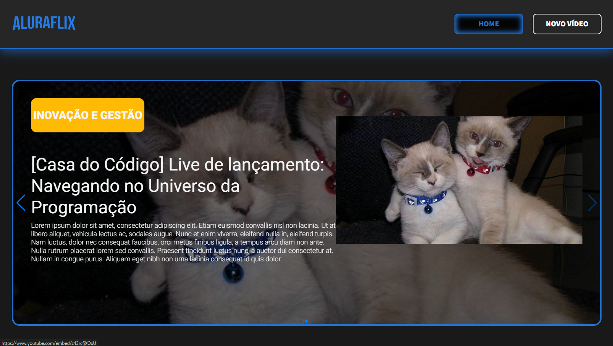
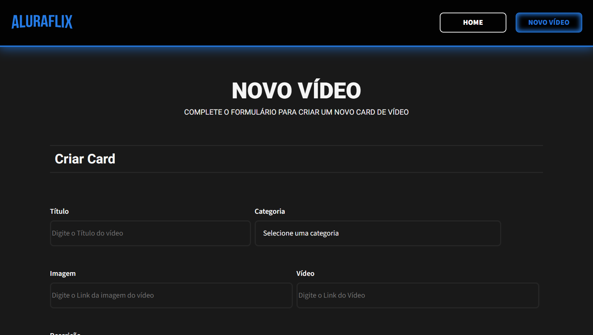
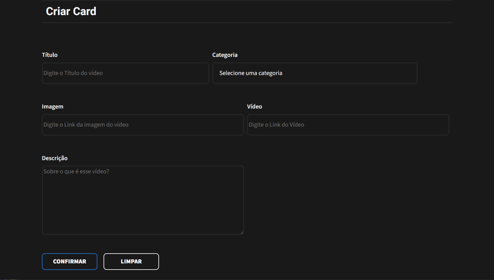

# Desafio Aluraflix Alura One ⭐
Este projeto é referente a um desafio de desenvolver um "Netflix" da Alura proposto no programa de React da Alura ONE (T6), onde o mesmo foi feito com o objetivo de praticar as habilidades de *React* desenvolvidas ao longo do curso.

## 📦 Pacotes

Alguns pacotes são necessários para o funcionamento da aplicação e devem ser instalados utilizando o seguinte comando:

```
npm install
```

Os pacotes utilizados e suas respectivas versões são:

```
"react-router-dom": "^6.24.1"
"axios": "^1.7.2"
"json-server": "^1.0.0-beta.1"
"swiper": "^11.1.4"
"uuid": "^10.0.0"
```

## 🔧 Execução local

Uma sequência de comandos deve ser utilizada no terminal para rodar a aplicação localmente. Primeiramente, deve-se rodar a API com os dados json da aplicação utilizando node.js, onde o mesmo se dará na porta 8000 para que não haja conflito com a aplicação em si:

```
json-server --watch db.json --port 8000
```

Após isso, podemos iniciar a aplicação em si:
```
npm start
```

## 🖼️ Imagens da Aplicação
A seguir, é possível observar imagens da aplicação em execução:


*Carrosel de vídeos salvos*


*Sections separadas por categorias de vídeos salvos*


*Modal para edição de informações dos vídeos*


*Página para inserir novos vídeos*


*Formulário para inserir novos vídeos*